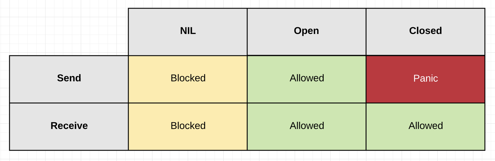

# Chapter 3 - The language

## Data

### Primitive types

- Integer types
  - uint8
  - uint16
  - uint32
  - uint64
  - int8
  - int16
  - int32
  - int64
  
- Floating types
  - float32
  - float64
  - complex64
  - complex128

- Other numeric types
  - byte (same as uint8)
  - rune (same as int32)
  - uint (32 or 64 bits)
  - int (32 or 64 bits)
  - uintptr (an unsigned integer to store the uninterpreted bits of a pointer value)

- Booleans
- Strings

Declaration will always initialize the variable to the default value of a type:

- Integers to `0`
- Floating points to `0.0`
- Boolean to `false`
- String to ""

### Arrays

You can declare an array as follows:

```go
var variable_name [SIZE] variable_type
```

e.g.

```go
var balance [10]float32
```

### Slices

A slice is a abstraction over an array. It actually uses arrays as an underlying structure, but it allows for growth and or returning a sub-array.

We can declare them as follows:

```go
var numbers []int
```

or we can use the build in function `make` as follows:

```go
numbers := make([]int,5,5) // A slice of length 5 and capacity 5.
```

Hint: If we know the capacity of the slice upfront we should use make() in order to allocated the final size since the slice will grow if we add a item and the map does not have space.

```go
numbers := make([]int,0,5) // A slice of length 0 and capacity 5.
```

we can also declare and assign in one swoop:

```go
numbers := []int{0,1,2,3,4,5,6,7,8}  
```

The default value of a slice is nil but when we ask for it's `length()` or `cap()` it will return zero.

Appending a value to a slice is done with the built in `append()` method:

```go
numbers := make([]int,5,5) // A slice of length 5 and capacity 5.
numbers = append(numbers, 11)
```

Sub-slicing is used to get a sub slice from a slice by providing an upper and/or lower bound.

```go
numbers := []int{0,1,2,3,4,5,6,7,8}
numbers[1:4] // [1 2 3]
numbers[:3] // [0 1 2]
numbers[4:] // [4 5 6 7 8]
```

More details can be found in [Go Slices: usage and internals](https://blog.golang.org/go-slices-usage-and-internals).

### Maps

A map maps unique keys to values. The declaration is as follows:

```go
var mp map[string]int

mp = make(map[string]int, 10)
```

We cannot add anything to a map until we initialized it with `make()` because the declaration only will be nil. Adding capacity to make pre-allocates memory.

Adding items to a map can be achieved with:

```go
mp = make(map[string]int, 10)
mp["test"] = 10
```

If the key does not exist it will be created and the value added. If the key exists it will update the value.

We can get a value by accessing the key:

```go
d := mp["test"]
```

The above is a little bit tricky. If the key exists then the value is returned. If the key does not exist the variable d will contain the initialized value of the type which is 0. In order to see if the value existed we can use:

```go
d, ok := mp["test"]
if ok {
    ...
}
```

Only if `ok` is true we know that the key existed.

**Another point to remember is the key/values returned in a `for range`. The order of the key/values is not preserved and will be returned in a pseudo random fashion. So you will get different results every time you range over a map!!!**

### Pointers

A pointer is a variable that point whose address is the value of the address of another variable.

```go
var ip *int
var fp *float32
```

The default value of a pointer declaration is always nil.  
Go has no pointer arithmetics.

In order to set a value to a pointer we:

```go
var ip *int
data := 1
ip = &data
```

And in order to get the value that a pointer points to:

```go
data = *ip
```

### Constants

Constants refer to fixed values that the program may not alter during its execution. These fixed values are also called literals.

Constants can be of any of the basic data types like an integer constant, a floating constant, a character constant, or a string literal. There are also enumeration constants as well.

Constants are treated just like regular variables except that their values cannot be modified after their definition.

We can use constants to create enumerations:

```go
type State string

const (
    Active   State = "active"
    Inactive State = "inactive"
)
```

If we are using `iota` we can assign numeric values to enumerations automatically.

```go
type ByteSize float64

const (
    _           = iota                   // ignore first value by assigning to blank identifier
    KB ByteSize = 1 << (10 * iota) // 1 << (10*1)
    MB                                   // 1 << (10*2)
    GB                                   // 1 << (10*3)
)
```

## Initialization

Every declared variable will be initialized.
Primitive types will be initialized with the default value of the type e.g. `bool` will always initialize to `false`, `int` to `0`, `string` to `""`, etc., and a pointer to nil.

When the type is a struct then the initialization will occur on every field of the struct.

### Allocations

assuming we have the following struct:

```go
type SyncedBuffer struct {
    lock    sync.Mutex
    buffer  bytes.Buffer
}
```

The function `new()` is used to allocate memory for a struct:

```go
p := new(SyncedBuffer)  // type *SyncedBuffer
var v SyncedBuffer      // type  SyncedBuffer
```

the resulting `buf` will be a pointer to a zeroed out initialized `SyncedBuffer` and the `buf1` will be a initialized variable of `SyncedBuffer`.

Both of the above will actually have a `SyncedBuffer` initialized which means that `lock`(in a unlocked state) and buffer(empty buffer ready to use) fields will be initialized to their defaults, and ready for use.

### Stack vs Heap [FAQ](https://golang.org/doc/faq#stack_or_heap)

From a correctness standpoint, you don't need to know. Each variable in Go exists as long as there are references to it. The storage location chosen by the implementation is irrelevant to the semantics of the language.

The storage location does have an effect on writing efficient programs. When possible, the Go compilers will allocate variables that are local to a function in that function's stack frame. However, if the compiler cannot prove that the variable is not referenced after the function returns, then the compiler must allocate the variable on the garbage-collected heap to avoid dangling pointer errors. Also, if a local variable is very large, it might make more sense to store it on the heap rather than the stack.

In the current compilers, if a variable has its address taken, that variable is a candidate for allocation on the heap. However, a basic escape analysis recognizes some cases when such variables will not live past the return from the function and can reside on the stack.

There is a way to check what happens in your code in order to see where a variable will be allocated. This is called escape analysis and is a advanced topic not covered here.

In general we should not hunt for performance optimizations of these types and focus on the task at hand. Optimization can always take place in the future and after it becomes a problem. This is why it makes sense for some services to monitor also the memory and the GC of a Go process.

### The `init()` function

Finally, each source file can define its own niladic init function to set up whatever state is required. (Actually each file can have multiple init functions.) And finally means finally: init is called after all the variable declarations in the package have evaluated their initializers, and those are evaluated only after all the imported packages have been initialized.

Besides initializations that cannot be expressed as declarations, a common use of init functions is to verify or repair correctness of the program state before real execution begins.

We should generally avoid having init functions and only use them when absolutely necessary.
A classic example in our code is to initialize prometheus metric primitives.

A good read on the above is [A theory of modern Go](https://peter.bourgon.org/blog/2017/06/09/theory-of-modern-go.html).

## Control Structures

### for

Go does have only one way to loop which has some variations:

The standard for loop is:

```go
for i := 0; i < 10; i++ {
    ...
}
```

another option that resembles a while loop is:

```go
enabled := true
for enabled {
}
```

and, of course, an endless loop (you should though have a exit condition):

```go
for {
    ...
}
```

The for loop allows also to enumerate a `collection` of things like slices and maps as follows:

```go
prices := []float64{}
for i, price := range prices {
    ...
}
```

where `i` is the index in the slice and `price` is the value at that index. For maps the range returns the key and the value.

- switch
- type switch
- if
  - if condition {}
  - if err:=something(); err != nil {}
  - if ok:=something(); ok {}

## Errors

### Handling

Let's assume we have the following function:

```go
func Balance() (int, error) {
    return 1, nil
}
```

We can call the function and check the error like this:

```go
func errorCheck1() error {
    _, err := Balance()
    if err != nil {
        return err
    }
    return nil
}
```

or like this:

```go
func errorCheck2() error {
    if _, err := Balance(); err != nil {
        return err
    }
    return nil
}
```

### Errors are values

A lot of times developers complain about the amount of code they have to write for error checks.
If we treat the errors as values we can reduce the amount of these checks a lot.
Let's assume we have the following function and the usage:

```go
func Write(msg string) error {
    return nil
}

func errorCheck3() error {
    err := Write("1")
    if err != nil {
        return err
    }
    err = Write("2")
    if err != nil {
        return err
    }
    err = Write("3")
    if err != nil {
        return err
    }
    return nil
}
```

Pretty repetitive. But if we create the following:

```go
type errWriter struct {
    err error
}

func (ew *errWriter) Write(msg string) {
    if ew.err != nil {
        return
    }
    ew.err = Write(msg)
}
```

Then the above usage becomes:

```go
func errorCheck4() error {
    var wr errWriter
    wr.Write("1")
    wr.Write("2")
    wr.Write("3")
    if wr.err != nil {
        return wr.err
    }
    return nil
}
```

### Panic

Panic is a built-in function that stops the ordinary flow of control and begins panicking. When the function F calls panic, execution of F stops, any deferred functions in F are executed normally, and then F returns to its caller. To the caller, F then behaves like a call to panic. The process continues up the stack until all functions in the current goroutine have returned, at which point the program crashes. Panics can be initiated by invoking panic directly. They can also be caused by runtime errors, such as out-of-bounds array accesses.

Go proverb: `Don't panic.`

### Recover

Recover is a built-in function that regains control of a panicking goroutine. Recover is only useful inside deferred functions. During normal execution, a call to recover will return nil and have no other effect. If the current goroutine is panicking, a call to recover will capture the value given to panic and resume normal execution.

We will see in the `function and methods` section how to use recover and defer.

## Functions and methods

Functions and methods in Go can return multiple values.

```go
type Balance struct {
    amount int
}

func (b *Balance) Balance() (int, error) {
    if b.amount == 0 {
        return 0, errors.new("you don't have any money")
    }
    return b.amount, nil
}
```

There is also the possibility to name the results and even simple return without providing the value (naked return):

```go
func (b *Balance) BalanceNamedNaked() (balance int, err error) {
    if b.amount == 0 {
        err = errors.New("you don't have any money")
    } else {
        balance = b.amount
    }
    return
}
```

Name return values should only be used to make the code easier to understand `Coordinates() (lat,lng float64)`.
Naked return should be generally avoided.

### The main function

The main function is a special function that go uses as an entry point in order to start the executable.

```go
func main() {
}
```

### Arguments

Arguments are always passed in by value, meaning you get a copy. If you want to modify the argument or if you want to avoid the copy of a big struct you should use a pointer.

### Defer

Go's defer statement schedules a function call (the deferred function) to be run immediately before the function executing the defer returns. A classic example is a mutex operation:

```go
func (b *Balance) Update(amount int) {
    b.mu.Lock()
    defer b.mu.Unlock()
    b.amount = amount
}
```

The mutex unlock is guaranteed to run before the method exits.

You can have multiple defers and they get executed in a LIFO fashion so the following function will print `1,2,3`:

```go
func lifo() {
    defer fmt.Print(3)
    defer fmt.Print(2)
    defer fmt.Print(1)
}
```

Another nice use of defer is to recover from panics.

```go
func panicRecover() {
defer func() {
    if r := recover(); r != nil {
        fmt.Print("Recovered %v", r)
    }
}()
panic(1)
}
```

Now that we have a mechanism to recover from panics someone might think that it is like a `try catch` and starts to use panics like exceptions. Remember that panics should be avoided.

## Structs

### Constructor

Since go initializes a structure by zeroing out all the fields we might take advantage of this and, as the Go proverb mentions, `make the zero value useful`. We can also add a little code in the methods in order to do some initialization.

```go
type Cache struct {
    m map[string]interface{}
}

func (c *Cache) Set(k string, v interface{}) {
    if c.m == nil {
        c.m = make(map[string]interface{}, 0)
    }
    c.m[k] = v
}

func main() {
    c := Cache{}
    c.Set("key", "value")
}
```

The benefit with this approach is that we do not need an extra `constructor` and if we embed the struct it will be work without the need to initialize it.

There are cases though, when we need to initialize a struct with valid data. Since Go does not support constructors, we have to create functions that do the job for us.
Lets assume we have a customer struct:

```go
type Customer struct {
    name    string
    age     int
}
```

A constructor might be:

```go
func NewCustomer(name string, age int) (*Customer, error) {
    if name == "" {
        return nil, errors.New("name is required")
    }
    if age < 0 {
        return nil, errors.New("age should be greater than 0")
    }
    return &Customer{name:name, age:age}, nil
}
```

### Getter and Setters (Methods)

```go
func (c *Customer) Age() int {
    return c.age
}

func (c *Customer) SetAge(age int) error {
    if age < 0 {
        return errors.New("age should be greater than 0")
    }
    c.age = age
    return nil
}
```

### Value vs Pointer Receiver

In the above example the receiver is the part in parenthesis between the keyword `func` and the name of the method `SetAge`.
You should think as if the receiver is the first argument of the method:

```go
func SetAge(c *Customer, age int) error {
```

By convention all receivers of a struct should be either value or pointer. Never mixed.

When you should use a pointer receiver?

- Small struct: **value**
- Method that modifies the receiver: **pointer**
- Large struct: **pointer**
  - Threshold: “would the fields in my struct be small enough if used as method arguments?”
- Struct with growing fields (string, array, etc.): **pointer**
- Can't decide? **pointer**

Hint: As with pointer, try not to optimize by using only pointers since this might put stress on the GC. Optimize only if there is an actual problem.

### Embedding

Let's assume that we have a base entity type with the following fields:

```go
type BaseEntity struct {
    id      int
    created time.Time
}

func (b *BaseEntity) ID() int {
    return b.id
}

func NewBaseEntity(id int, created time.Time) BaseEntity {
    return BaseEntity{id: id, created: created}
}
```

and we want the customer to *inherit* the fields we embed as follows:

```go
type Customer1 struct {
    BaseEntity
    name string
}

func (c *Customer1) SetCreated(created time.Time) {
    c.created = created
}
```

Customer1 will get the following:

- The getter `ID()`
- Access to all the fields of the base entity
- Access to the fields of the base entity via a field `BaseEntity`

In order to create a constructor you have to:

```go
func NewCustomer1(id int, created time.Time, name string) *Customer1 {
    return &Customer1{
        BaseEntity: NewBaseEntity(id, created),
        name:       name,
    }
}
```

### Exercise

We have the following Entities:

- Order
  - An id
  - Order lines
  - The total cost
  - The created date
  - The user that created the order

- OrderLine
  - An id
  - An item
  - The created date
  - The quantity
  - The unit price

For the above entities we need the following:

- Create an order
- Append an order line
- Update an order line
- Remove an order line
- Print the total price

## Interfaces

An interface consists of the type declaration and the methods that it supports.

```go
type Reader interface {
    Read() string
}

type Closer interface {
    Closer() error
}
```

If a struct has a method that matches the above `Read() string` it automatically satisfies the interface.

We should try to create single method interfaces since we can easily compose them to bigger

### Empty interface

Since generics are not available and there is a need to cover the possibility that an argument can be different types we can use the empty interface `interface{}`.

One of the Go provers states `The empty interface says nothing` and we should only use it if it is absolutely necessary.

### Embedding

Given the above single method interfaces it is easy to compose a bigger one as follows:

```go
type ReadCloser interface {
    Reader
    Closer
}
```

## Concurrency

### [Concurrency is not parallelism](http://www.youtube.com/embed/cN_DpYBzKso)

**Concurrency is about dealing with lots of things at once.**

**Parallelism is about doing lots of things at once.**

### Green threads

In computer programming, green threads are threads that are scheduled by a runtime library or virtual machine (VM) instead of natively by the underlying operating system. Green threads emulate multi-threaded environments without relying on any native OS capabilities, and they are managed in user space instead of kernel space, enabling them to work in environments that do not have native thread support ([[https://en.wikipedia.org/wiki/Green_threads][wiki]]).

Some example languages are:

- .NET Framework's ([[https://docs.microsoft.com/en-us/dotnet/standard/parallel-programming/task-based-asynchronous-programming][TPL]])
- Erlang (Processes, Actors)
- Haskell's coroutines
- Go's goroutines

### Goroutines

- no thread pool
- small stack compared to other implementations (4kB instead of 1-8MB) which makes them cheap to create
- if a goroutine blocks (network, sleeping, channels, sync...) another will be scheduled instead

```go
go func(a int){
    ...
}(1)
```

### Channels

Inspired from Hoare's Communicating Sequential Processes, or CSP.

Channels are the pipes that connect concurrent goroutines.
You can send values into channels from one goroutine and receive those values into another goroutine.

- unbuffered

```go
ch := make(chan string)
```

- buffered

```go
ch := make(chan string, 10)
```

Both block eventually if no consumer is hooked.

When using channels as arguments in function and methods we can specify if we:

- receive data only

```go
func test(ch <-chan string)
```

- send data only

```go
func test(ch chan<- string)
```

- both

```go
func test(ch chan string)
```

The code is checked compile time!

Channels are about signaling!

#### Chanel State

- nil

```go
var ch chan string
or
ch = nil
```

- open

```go
ch := make(chan string)
```

- close

```go
close(ch)
```



#### Guarantee Of Delivery


#### Signaling With Data


- Guarantee

    An unbuffered channel gives you a guarantee that a signal being sent has been received,
    because the receive of the signal happens before the send of the signal completes.

- No Guarantee

    A buffered channel of size >1 gives you No guarantee that a signal being sent has been received,
    because the send of the signal happens before the receive of the signal completes.

- Delayed Guarantee

    A buffered channel of size =1 gives you a delayed guarantee. 
    It can guarantee that the previous signal that was sent has been received,
    because the receive of the first signal, happens before the send of the second signal completes.

#### Signaling Without Data


#### Send

- send with data

```go
ch := make(chan string)
ch <- "test"
```

#### Send without data

```go
ch := make(chan struct{})
ch <- struct{}{}
```

Hint: **It is the zero-space, idiomatic way to indicate a channel used only for signalling**

#### Receive

```go
ch := make(chan int)
close(ch)
val, ok := <-ch
fmt.Printf("val: %d ok: %t\n", val, ok)
```

ok is false if the channel is closed and val's value is the default for the type

- for range loop

```go
for val := range ch {
    fmt.Print(val)
}
```

for exits if the channel is closed

- select (multiple channels)

```go
select {
    case <-ctx.Done():
    ...
    case val, ok := <-ch:
    ...
}
```

ok is false if the channel is closed

- deadlock

```go
ch := make(chan int)
val, ok := <-ch
fmt.Printf("val: %d ok: %t\n", val, ok)
```

#### Examples

- Send data to goroutine, wait for goroutine to complete (channel3.go)

```go
ch := make(chan string)

go func() {
    fmt.Print(<-ch)
    close(ch)
}()

ch <- "Hello"
<-ch
fmt.Print(", World!\n")
```

- Loop and close (channel4.go)

.play src/channel4.go  /START OMIT/,/END OMIT/

```go
ch := make(chan string, 4)
chSig := make(chan struct{})

go func() {
    for val := range ch {
        fmt.Print(val)
    }
    chSig <- struct{}{}
}()

for i := 1; i < 4; i++ {
    ch <- fmt.Sprintf("%d,", i)
}
close(ch)
<-chSig
fmt.Print(" Boom!\n")
```

### Context package

Package context defines the Context type, which carries deadlines, cancellation signals, and other request-scoped values across API boundaries and between processes.

Context can form a tree of contexts every time we use one of the next functions.

- WithCancel(parent Context) (ctx Context, cancel CancelFunc)

```go
childCtx, cnl := context.WithCancel(ctx)
...
cnl()
```

- WithDeadline(parent Context, d time.Time) (Context, CancelFunc)

```go
childCtx, cnl := context.WithDeadline(ctx, d)

...

cnl() // or the deadline passed
```

- WithTimeout(parent Context, timeout time.Duration)

```go
childCtx, cnl := context.WithTimeout(ctx, 1 * time.Second)

...

cnl() // or timeout passed
```

Context can be used to propagate cross-functional stuff also.

**The convention is that every function or method that need to use or propagate context has it as its first argument:**

```go
func test(ctx context.Context, name string)
```

#### Cancel a worker example

- Setup

```go
chDone := make(chan struct{})
ch := make(chan int, 1000)
ctx, cnl := context.WithCancel(context.Background())
```

- Producer

```go
go func() {
    i := 0
    for {
        if ctx.Err() != nil {
            fmt.Print("Producer Done\n")
            chDone <- struct{}{}
            return
        }
        ch <- i
        i++
        time.Sleep(100 * time.Millisecond)
    }
}()
```

- Consumer

```go
go func() {
    for {
        select {
        case <-ctx.Done():
            fmt.Print("Writer Done\n")
            chDone <- struct{}{}
            return
        case n := <-ch:
            fmt.Printf("%d\n", n)
        }
    }
}()
```

- Sync

```go
time.Sleep(10 * time.Second)
cnl()
<-chDone
<-chDone
```

Take a look at the [full example.](src/context1.go)

### Sync package

Package sync provides basic synchronization primitives such as mutual exclusion locks.
Other than the Once and WaitGroup types, most are intended for use by low-level library routines.
Higher-level synchronization is better done via channels and communication.

#### WaitGroup (sync1.go)

A WaitGroup waits for a collection of goroutines to finish.
The main goroutine calls Add to set the number of goroutines to wait for.
Then each of the goroutines runs and calls Done when finished.
At the same time, Wait can be used to block until all goroutines have finished.

```go
wg := sync.WaitGroup{}
for i := 0; i < 5; i++ {
    wg.Add(1)
    go func(i int) {
        defer wg.Done()
        fmt.Printf("%d\n", i)
        time.Sleep(1 * time.Second)
    }(i)
}
wg.Wait()
```

- Mutex

Mutual exclusion lock.
Channels internally work with mutexes.

```go
type sum struct {
    sync.Mutex
    sum int
}

func (s *sum) add(i int) {
    s.Lock()
    defer s.Unlock()
    s.sum = s.sum + 1
}

func main() {
    wg := sync.WaitGroup{}
    s := sum{}
    for i := 0; i < 5; i++ {
        wg.Add(1)
        go func(i int) {
            defer wg.Done()
            s.add(i)
        }(i)
    }
    wg.Wait()
    fmt.Printf("Sum: %d\n", s.sum)
}
```

Check out the [full example](src/sync2.go).

- RWMutex

Same as Mutex. Readers don't block each other but one writer blocks all (readers and writers).

### Concurrency patterns

#### Pipeline

Setting up a 3 stage pipeline

- generate numbers

```go
func gen(ch chan<- int) {
    for i := 1; i <= 10; i++ {
        ch <- i
    }
    close(ch)
}
```

- square numbers

```go
func sq(ch <-chan int, chRes chan<- int) {
    for v := range ch {
        chRes <- v * v
    }
    close(chRes)
}
```

- print numbers (inside the main) (pattern1.go)

```go
numbers := make(chan int, 10)
results := make(chan int, 10)
go gen(numbers)
go sq(numbers, results)

for result := range results {
    fmt.Printf("Result: %d\n", result)
}
```

Take a look at the [full example](src/pattern1.go).

#### Fan Out/In


- Work distributing

- Distribute work

```go
func distr(ch <-chan int, chRes chan<- int) {
    wg := sync.WaitGroup{}
    for v := range ch {
        wg.Add(1)
        go func(v int) {
            defer wg.Done()
            sq1(v, chRes)
        }(v)
    }
    wg.Wait()
    close(chRes)
}
```

- main (pattern2.go)

```go
numbers := make(chan int, 10)
results := make(chan int, 10)
go gen1(numbers)
go distr(numbers, results)
for result := range results {
    fmt.Printf("Result: %d\n", result)
}
```

Take a look at the [full example](src/pattern2.go).

- Work stealing

- spin up workers

```go
func workers(ch <-chan int, chRes chan<- int) {
    wg := sync.WaitGroup{}
    for i := 0; i < 10; i++ {
        wg.Add(1)
        go func() {
            defer wg.Done()
            sq2(ch, chRes)
        }()
    }
    wg.Wait()
    close(chRes)
}
```

- main

```go
numbers := make(chan int, 10)
results := make(chan int, 10)
go workers(numbers, results)
go gen2(numbers)
for result := range results {
    fmt.Printf("Result: %d\n", result)
}
```

Take a look at the [full example](src/pattern3.go).

### Error handling

- exit application

```go
go func() {
    ...
    if err != nil {
        log.Fatalf("error: %v",err)
    }
}()
```

- using error chanel

```go
go func() {
    ...
    if err != nil {
        chErr <- err
    }
}()
```

- using result struct with error

```go
type Result struct {
    Err error
    Amount float
}

go func() {
    ...
    if err != nil {
        chRes <- Result{err:err}
    }
}()
```
